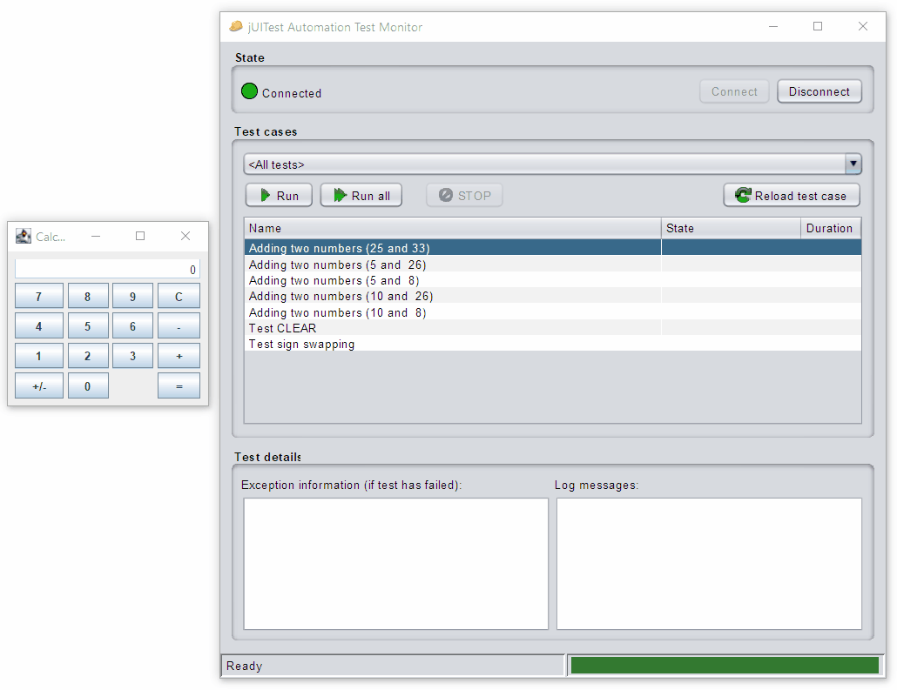

# jUITest
A gray-box testing framework for Java UI applications

## Gray-box UI testing

jUITest provides a basic infrastructure to do gray-box testing of Java UI applications. Gray-box testing means that in contrast to other UI testing frameworks the tests have access to the process space and source code of application under test. This can be accomplished by having a part of the framework (the testrunner) being run in the same process as the application-under-test.
This has the following advantages:

* Tests can access the complete visual structure of the application
* UI tests are debuggable (this means you can set breakpoints in the application under test if a debugger is attached)
* Hot-swap support: You can make changes to both tests and the application and hot swap them.

Of course, there are also possible disadvantages:
* Tests are coupled to the UI (but this is true for all UI testing frameworks)
* Since jUITest does (currently) not invoke a new instance of the application, tests might interfere with each other if application state is not correctly reverted between tests

jUITest provides a TestMonitor application which runs as a separate process.

## Purpose

jUITest has originally been developed to facilitate automatic testing of large, monolithic applications which a structured in a way which makes "normal" unit testing very hard (you could call them legacy applications). Often this means that application logic and UI are tightly coupled together and the function of the program cannot be tested without invoking the UI. Due to gray-box UI testing it is possible to test **both** internal and visual state of the application.
Additionally, when transforming such an application to a more loosely coupled, testable form jUITest can be used to ensure that the basic functionality of the application stays the same.

## See it in action

Below you can see the test monitor application in action which is used to run tests on a sample application (calculator):

